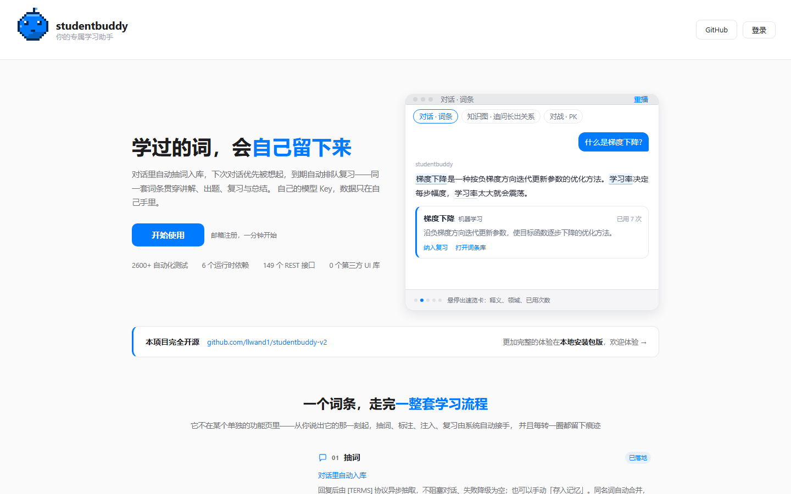
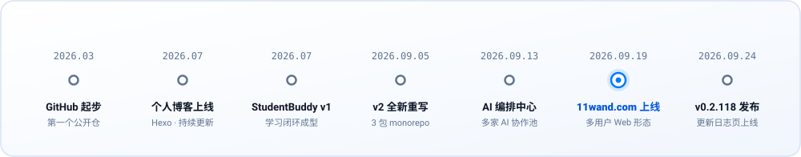

<picture>
  <source media="(prefers-color-scheme: dark)" srcset="assets/hero-dark.svg">
  <source media="(prefers-color-scheme: light)" srcset="assets/hero-light.svg">
  
</picture>

  
  
  

现在主要写 **AI 应用** 和 **Node 服务端**，习惯**先拿能跑的东西说话**——下面那个站点就是。

---

## 先看这个：11wand.com

> **▶ <https://11wand.com>**
> 我做的 AI 学习助手 **StudentBuddy** 的线上实例，2026-09-19 起持续运行，当前部署版本 `v0.2.118`。
> 首页点「**免注册，直接体验**」进完整产品，不用填邮箱。

它不是一个套了学习提示词的聊天框，而是把「学习」做成一条自己转得起来的闭环：

| 环 | 做的事 |
|:---:|---|
| **学** | 流式对话 · 思考链 · 联网检索 · 长文档 BM25 |
| **练** | 自建出题引擎 · 结构化协议 · 自动判分 · AI 特化配图 |
| **析** | 逐题正确率 · 薄弱点定位 · 学习趋势 |
| **忆** | AI 自学词条库 · 艾宾浩斯复习时钟 · 跨会话记忆 |
| **反馈** | 事件总线驱动 XP / 连签 / 今日总结 · AI 主动督促 |

落地页首屏 · 真机截图

应用壳 · 对话 —— 八视图导航 + 常驻督促胶囊

数据自持、本地优先：同一套代码既能单机跑（SQLite 单文件 + WAL），也能自建服务器多用户跑，模型 key 和词条都是你自己的。线上这台也是我自己运维的——小规格 VPS，Caddy 反代 + systemd，运行时只依赖 6 个第三方包、0 个第三方 UI 库。

  
  
  
  
  

---

## 里程碑

<picture>
  <source media="(prefers-color-scheme: dark)" srcset="assets/milestone-dark.svg">
  <source media="(prefers-color-scheme: light)" srcset="assets/milestone-light.svg">
  
</picture>

I build AI applications and Node backends — currently shipping **[StudentBuddy](https://11wand.com)**, a local-first learning assistant that runs online as a multi-user web service.
